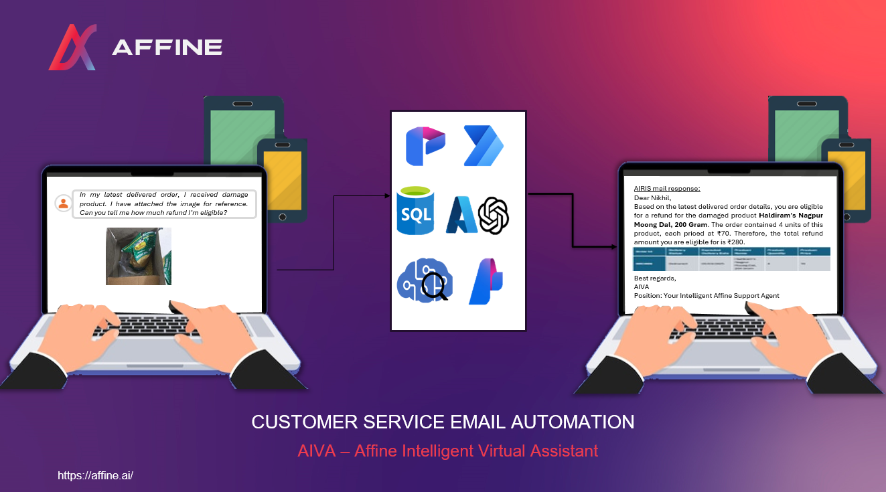
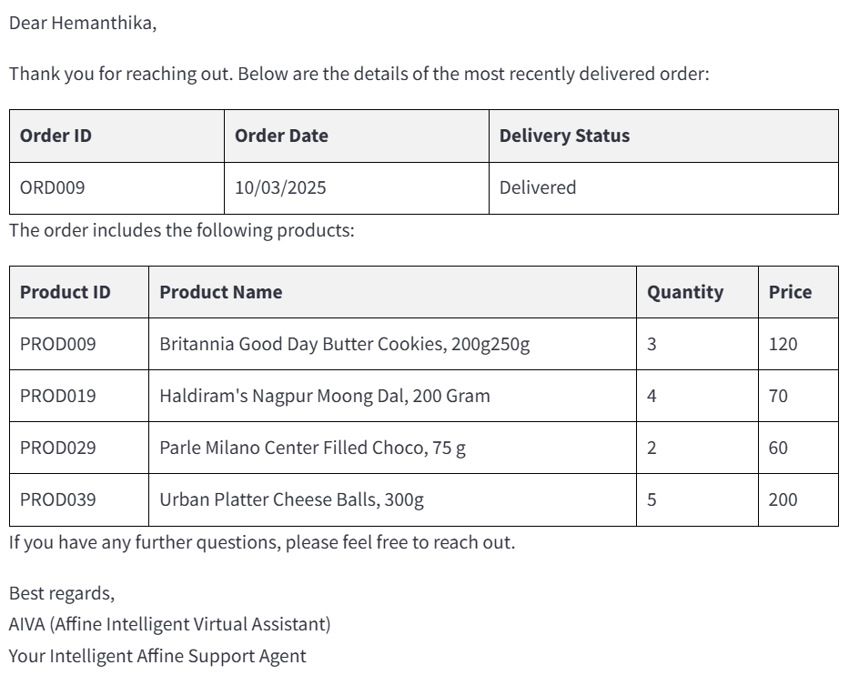
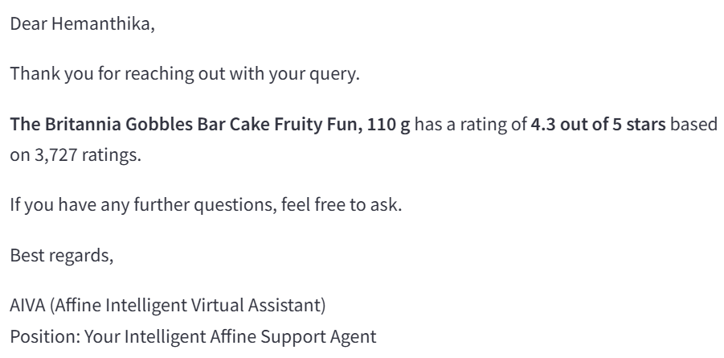
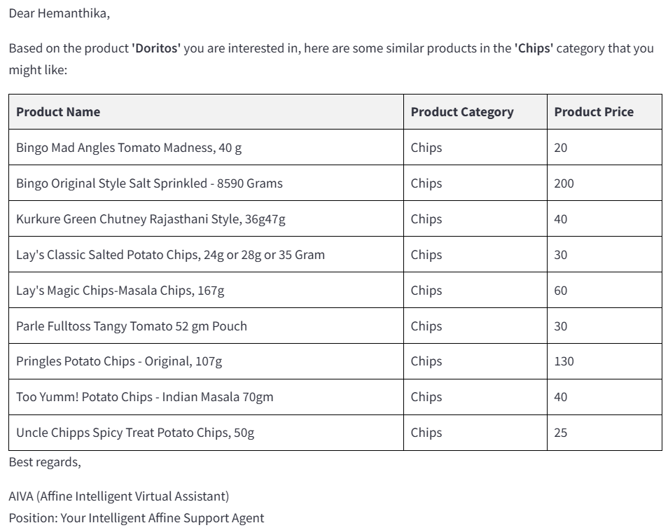
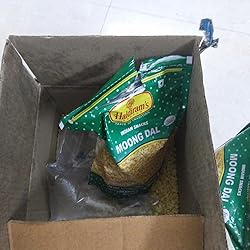
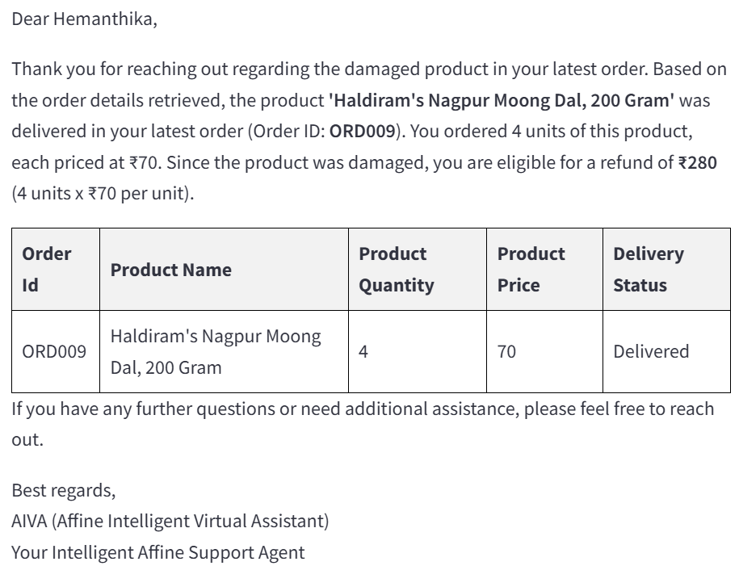

# Customer Service Email Automation Using AIVA - Affine Intelligent Virtual Assistant

Introducing AIVA – Affine Intelligent Virtual Assistant, a powerful multi-agentic AI system designed to revolutionize customer service email automation. AIVA seamlessly handles user queries related to orders, refunds, and more by directly connecting to data sources. Customers can simply send an email from any device, and AIVA efficiently processes the request, retrieves the necessary details, and responds instantly—ensuring a smooth and hassle-free support experience.



## About Repo
This repo code is exact replica of the deployed version of AIVA multi-agentic process shown in demo video which is deployed using Azure AI Foundry Promptflow. Only difference is here we used Autogen to develop multi-agentic system.    

## Usage
**Prerequisite**
- Contact ***akasapu.hemanthika@affine.ai*** to register your Email ID to AIVA service. Only when you register to AIVA you can test.

### Our Deployed Versions
We have deployed AIVA in two versions
1. AIVA - Power Automate and AI Foundry version: 
To test this from any device you can send email to ***aiva@affine.ai*** using any mail service. you will recieve reply in 1-2min
2. AIVA - Autogen version deployed as streamlit app: To use this, open link ***http://4.155.74.177:8501/***. Fill the requested details and you will be displayed final email response in the streamlit app.

### Local Testing
One can clone the repo and run it as streamlit app in local. Run the below command to start the streamlit app
```python
streamlit run aiva_st.py
```

## Additional Requirements and Information
- For using AIVA in local, create and fill in the Azure services details as mentioned .env file
- You can use data from the **./data/** folder 
- For LLM-based agents we used **GPT4o-08-06** model from Azure OpenAI
- Demo questions and related data can be accessed in folder **./demo/**
- More information related to AIVA can be found in the PPT - [AIVA-ppt](documentation/AIVA-ppt.pptx)
- 

## Demo Questions
In this project we worked on structured data (tables stored in Azure SQL Database) and unstructured data (text - product documents stored in Azure Search, product images). Below are various demo questions one can try to test capability of AIVA.

### Demo 1 - Database related
**Question:** 

Which order is delivered recently and what are all the products in it?

**AIVA Response:**



### Demo 2 - AI Search related
**Question:** 

What is the rating of Britannia cake?

**AIVA Response:**



### Demo 3 - Image related
**Question:** 

Can you recommend me similar products as attached image?

**Attached Image**

<!--  -->


**AIVA Response:**



### Demo 4 - Refund related
**Question:** 

In my latest delivered order, I received a damaged product. I have attached the image for reference. Can you tell me how much refund I’m eligible?

**Attached Image**



**AIVA Response:**


