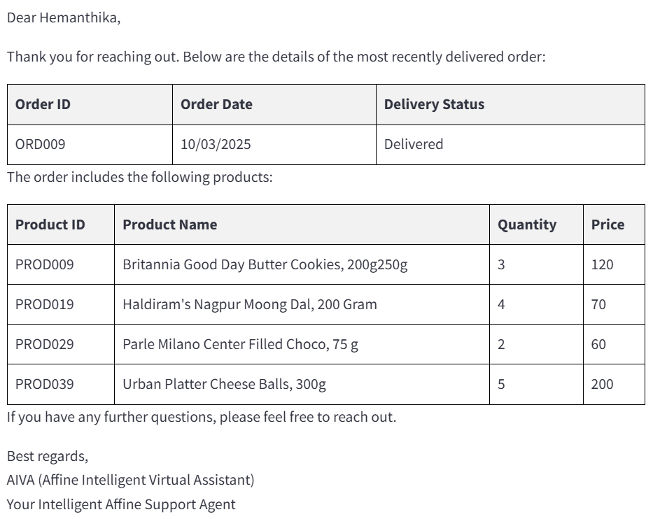

## Demo Questions
In this project we worked on structured data (tables stored in Azure SQL Database) and unstructured data (text - product documents stored in Azure Search, product images). Below are various demo questions one can try to test capability of AIVA

### Demo 1 - Database related
**Question:** 

Which order is delivered recently and what are all the products in it?

**AIVA Response:**

### Demo 2 - AI Search related
**Question:** 

What is the rating of Britannia cake?

**AIVA Response:**

### Demo 3 - Image related
**Question:** 

Can you recommend me similar products as attached image?

**Attached Image**

<!--  -->

**AIVA Response:**

### Demo 4 - Refund related
**Question:** 

In my latest delivered order, I received a damaged product. I have attached the image for reference. Can you tell me how much refund I’m eligible?

**Attached Image**

**AIVA Response:**

